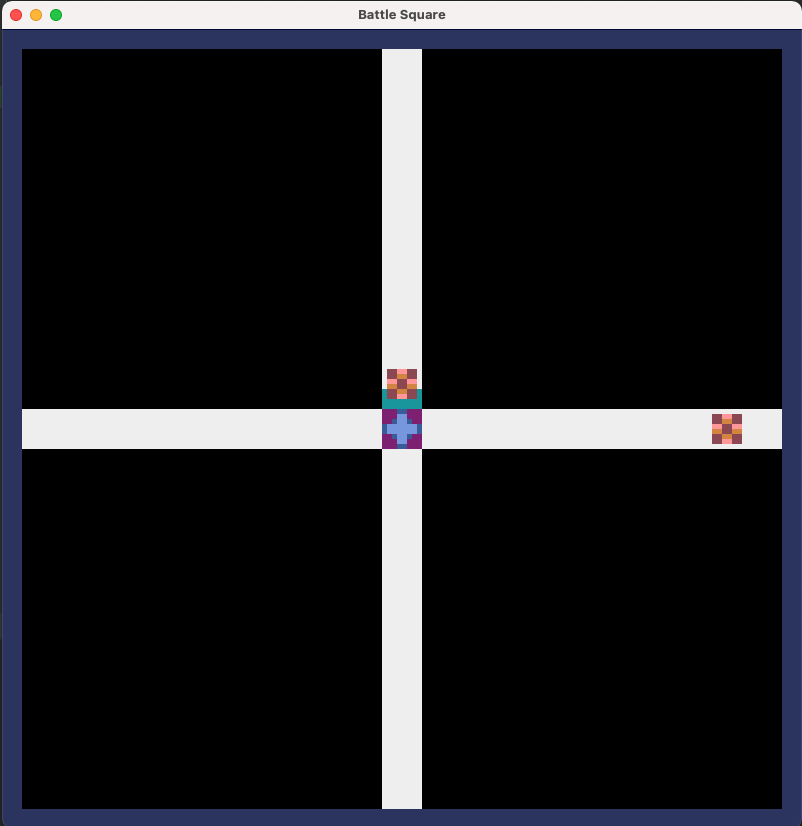

# SquareBreak

Square Break is a game developed in minutes that imitates the game [Bullets Squared](https://store.steampowered.com/app/1582960/Bullets_Squared/) game.

I wanted to try the library [Pyxel](https://github.com/kitao/pyxel) to create this game.

# How to run
## Step 1 Install requirements:
<code>
pip install -r requirements.txt
</code>

## Step 2 run main App:

<code>
python main.py
</code>

## Step 3 How to play

Just shot the incoming square before they collide with the player in 
the center on the screen, by pressing the keys Up/Down/Left/Right to shoot in that direction.

